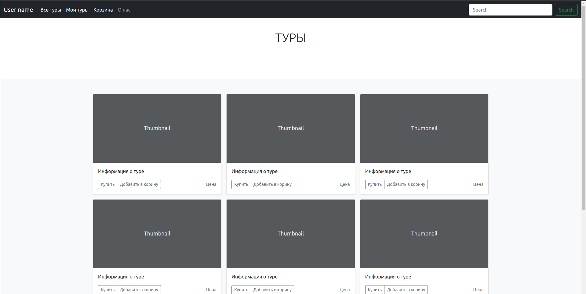
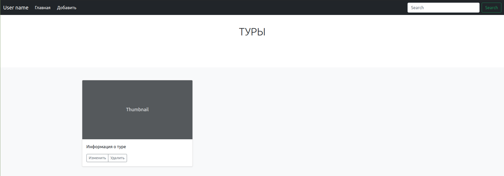
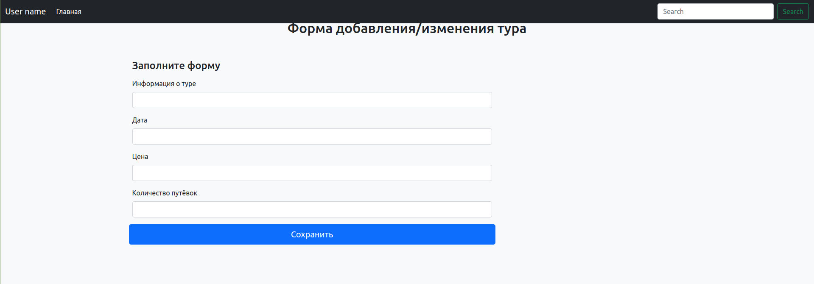
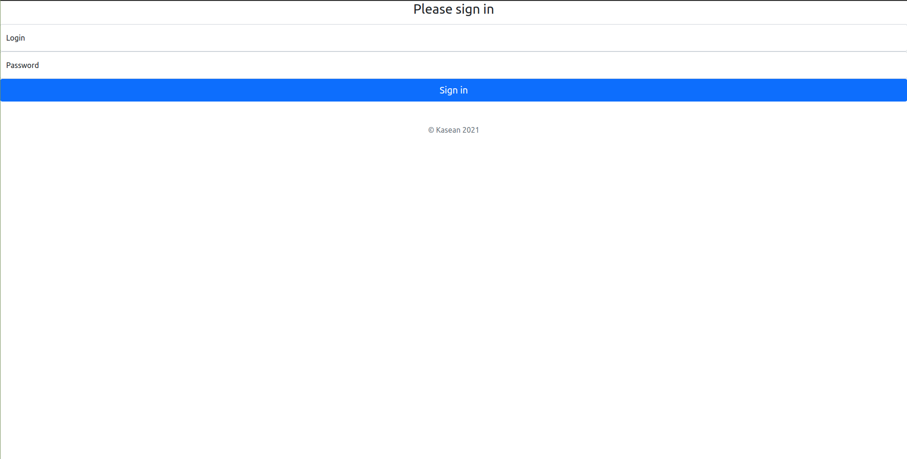

# Software Requirements Specification
## For TravelAgency

Version 0.1  
Prepared by Siarhei Kakichau  
EPAM Systems  
17.06.2021

##General understanding of the design problem
It is required to create a working prototype of a web application that implements the travel agent's work.
The application must implement the following features:
1. Viewing the list of tours and editing it (for the administrator).
2. Search tours by date.
3. Creation of new tours (for the administrator).
4. Editing tour information.

##1. Tour

###1.1 Viewing the list of tours 

All tours will be displayed on the "Главная" tab. The tour information will provide information about the direction, date, price and number of seats remaining.

For the administrator, the "Добавить" button will be displayed on this page, after clicking on which a window for adding a tour will appear.

When you click on the "Купить" button in the form describing the tour, the user's wallet will be checked. If there are enough funds, the tour will be added to "Мои туры", if not, a proposal will be displayed to replenish the account or add the tour to the "Корзина".

When you click on the "Добавить в корзину" button, the tour will be added to the wishlists on the "Корзина" tab

###1.2 Search tours
The date is entered in the corresponding field "Search" and after pressing the button "Search" Tours with the corresponding dates or information about their absence will be displayed.

###1.3 Add tour

The administrator can add a tour. On the main page of the administrator, you need to click on the "Добавить" button, after which a form for adding a tour will open, which must be filled out. By clicking on the "Сохранить" button, a request will be made to add a new tour to the database.

###1.4 Tour editing

The tour is edited by the administrator. In the form with information about the tour, you need to click on the "Изменить" button after which a form will open to change the information about the tour. It must be filled in and click on the "Сохранить" button

##2. User

The database stores information about users. To enter the system, you need to authorize. after filling out the form and pressing the "Sign in" button, an authorization request will occur. The application will check the user's role (user or administrator) and load the corresponding master page.

###2.1 User

The user can buy tours, add tours to the cart, search for tours by date. Read the company information. See all tours.

###2.2 Admin

The administrator can add tours, edit information about tours.